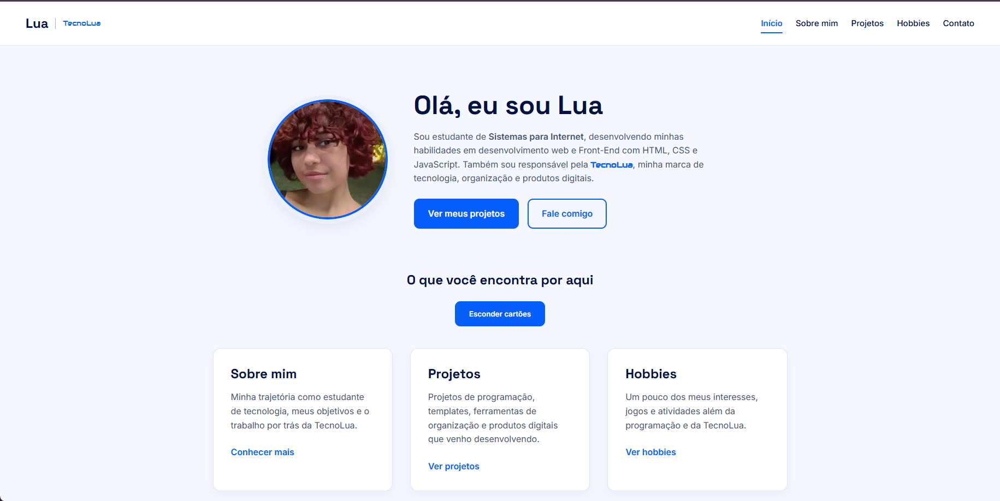
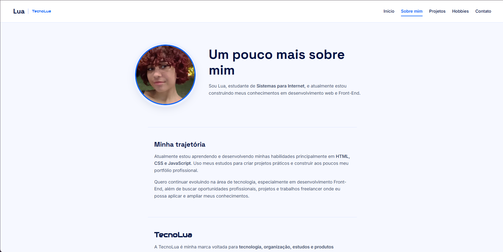
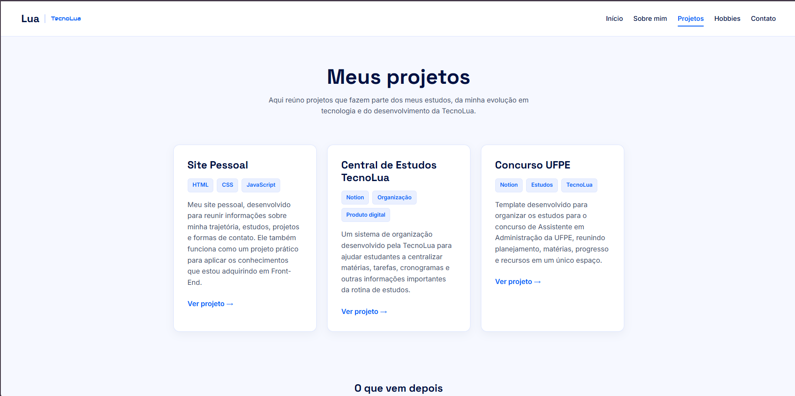

# 🌙 Site Pessoal — Lua

Site pessoal desenvolvido como projeto final da aula **BRClick — Criando Sites Profissionais**.

O projeto foi concluído em **18 de setembro de 2026** e representa uma etapa importante da minha evolução nos estudos de desenvolvimento Front-end.

O objetivo do site é reunir informações sobre minha trajetória, meus estudos, projetos, hobbies, formas de contato e também apresentar parte do trabalho desenvolvido na **TecnoLua**.

---

## 📸 Preview

### Página inicial

<p align="center">
  
</p>

### Sobre mim

<p align="center">
  
</p>

### Projetos

<p align="center">
  
</p>

---

## 💻 Sobre o projeto

Este site foi desenvolvido como resultado final das aulas do projeto **BRClick — Criando Sites Profissionais**.

Durante o desenvolvimento, construí um site pessoal completo utilizando **HTML, CSS e JavaScript**, aplicando na prática conceitos de estruturação de páginas, estilização, responsividade, navegação entre páginas e interatividade.

O projeto também foi utilizado para criar uma apresentação mais completa sobre minha trajetória como estudante de **Sistemas para Internet**, meus projetos de programação e o trabalho desenvolvido através da **TecnoLua**.

---

## 🛠️ Tecnologias utilizadas

- HTML5
- CSS3
- JavaScript
- Flexbox
- CSS Grid
- Media Queries
- Google Fonts

---

## 📄 Páginas do site

O projeto é dividido em diferentes páginas:

### 🏠 Início
Apresentação principal do site, com uma breve introdução sobre mim e atalhos para outras áreas.

### 👩‍💻 Sobre mim
Página dedicada à minha trajetória, meus estudos, objetivos profissionais e informações sobre a TecnoLua.

### 🚀 Projetos
Área onde apresento projetos de programação, produtos digitais e projetos desenvolvidos através da TecnoLua.

### 🎮 Hobbies
Página destinada a alguns dos meus interesses fora da programação, como jogos, tarô e criação digital.

### 📫 Contato
Página com meus canais profissionais e um formulário visual de contato.

---

## ✨ Funcionalidades

- Navegação entre múltiplas páginas
- Menu com indicação da página ativa
- Layout responsivo para diferentes tamanhos de tela
- Cards de conteúdo
- Seção de projetos
- Área de hobbies
- Página de contato
- Links para GitHub e LinkedIn
- Integração visual com a identidade da TecnoLua
- Botão para mostrar e esconder os cartões da página inicial
- Efeitos de interação com CSS

---

## 📱 Responsividade

O site possui ajustes específicos para telas menores através de **Media Queries**.

Foram utilizados pontos de adaptação para dispositivos com largura de até:

- `768px`
- `480px`

Isso permite que a interface se adapte melhor para tablets e celulares.

---

## 📚 O que pratiquei

Durante o desenvolvimento deste projeto, pratiquei conceitos como:

- Estrutura semântica de páginas HTML
- Uso de tags e atributos HTML
- Organização de arquivos
- Criação de múltiplas páginas
- Navegação entre arquivos HTML
- Classes e seletores CSS
- Flexbox
- CSS Grid
- Responsividade
- Media Queries
- Estados `hover`
- Tipografia e identidade visual
- Manipulação do DOM com JavaScript
- `querySelector`
- `addEventListener`
- `classList.toggle`
- Condicionais com `if` e `else`
- Organização e reutilização de estilos

---

## 📂 Estrutura do projeto

```text
site-pessoal/
│
├── assets/
│   ├── Foto perfil.jpg
│   ├── Telaa inicial.png
│   ├── Sobre mim.png
│   └── Prrojetos.png
│
├── index.html
├── sobre-mim.html
├── projetos.html
├── hobbies.html
├── contato.html
├── style.css
├── script.js
└── README.md
